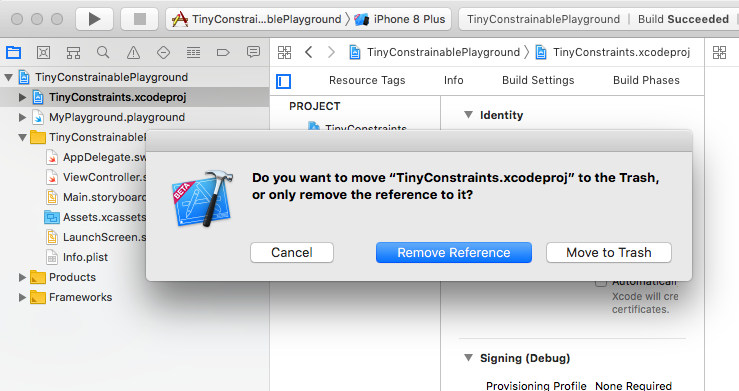
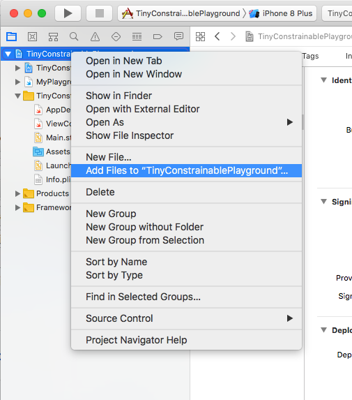
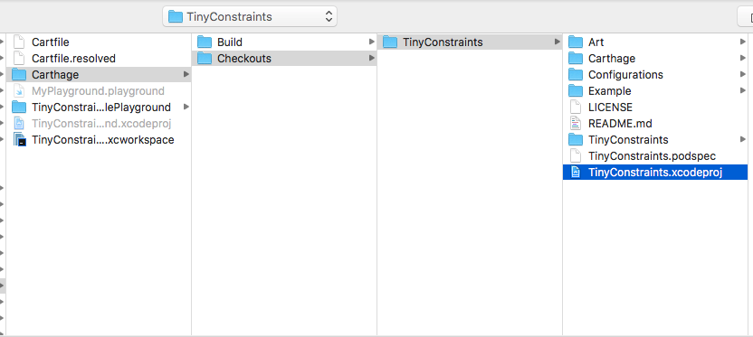

# TinyConstrainablePlayground
Workspace containing a Playground in which you can use [TinyConstraints](https://github.com/roberthein/TinyConstraints) via [Carthage](https://github.com/Carthage/Carthage) (only for XCode 10)

# Usage
- Open the `TinyConstrainablePlayground.xcworkspace` file in XCode 10
- Don't forget to Build the Project, otherwise the Framework won't be recognizes
- Play around in MyPlayground.playground

# Updating carthage
- Update TinyConstraints via Carthage like you normally do (`carthage update TinyCOnstraints --platform iOS`)
- Remove TinyConstraints.xcodeproj in the Project Navigator, but *only* remove the Reference:

- Right click on `TinyConstrainablePlayground` in the Project Navigator and select `Add Files to "TinyConstrainablePlayground"...`:

- Navigate to `Carthage > Checkouts > TinyConstraints` and add `TinyConstraints.xcodeproj`:

- Don't forget to Build the Project, otherwise the Framework won't be recognizes

